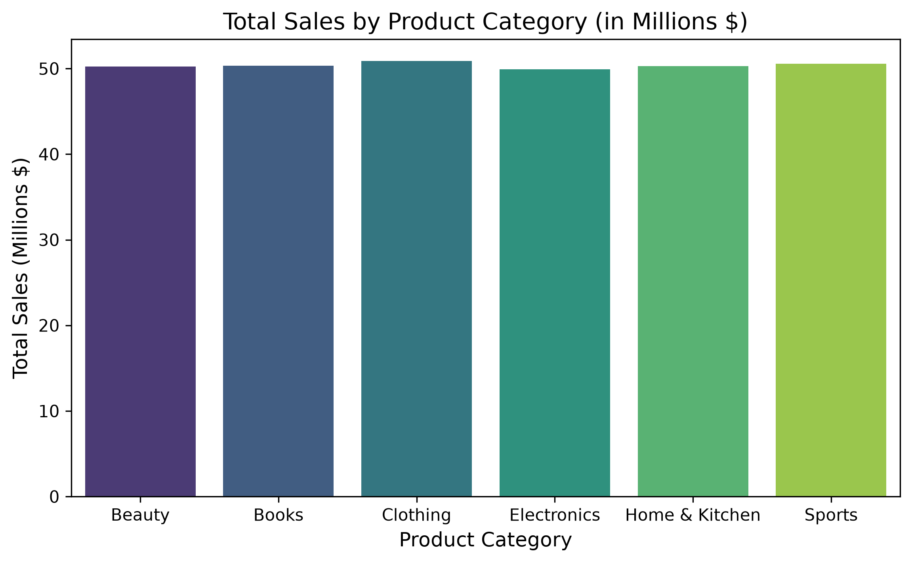
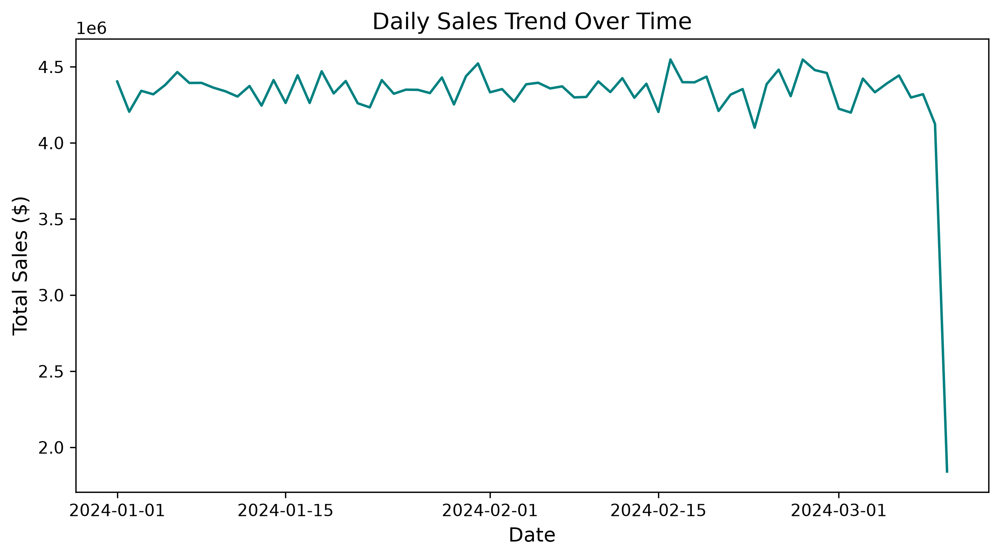
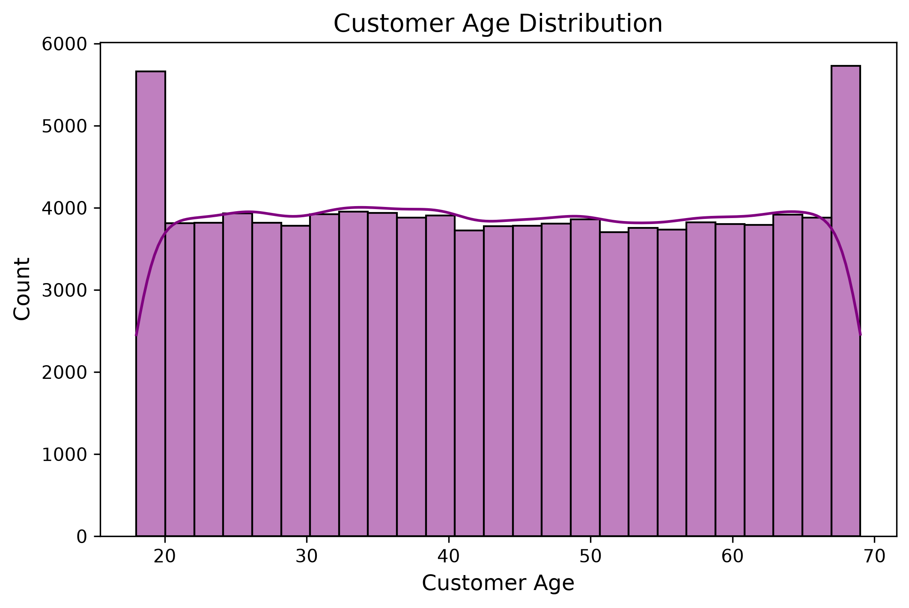
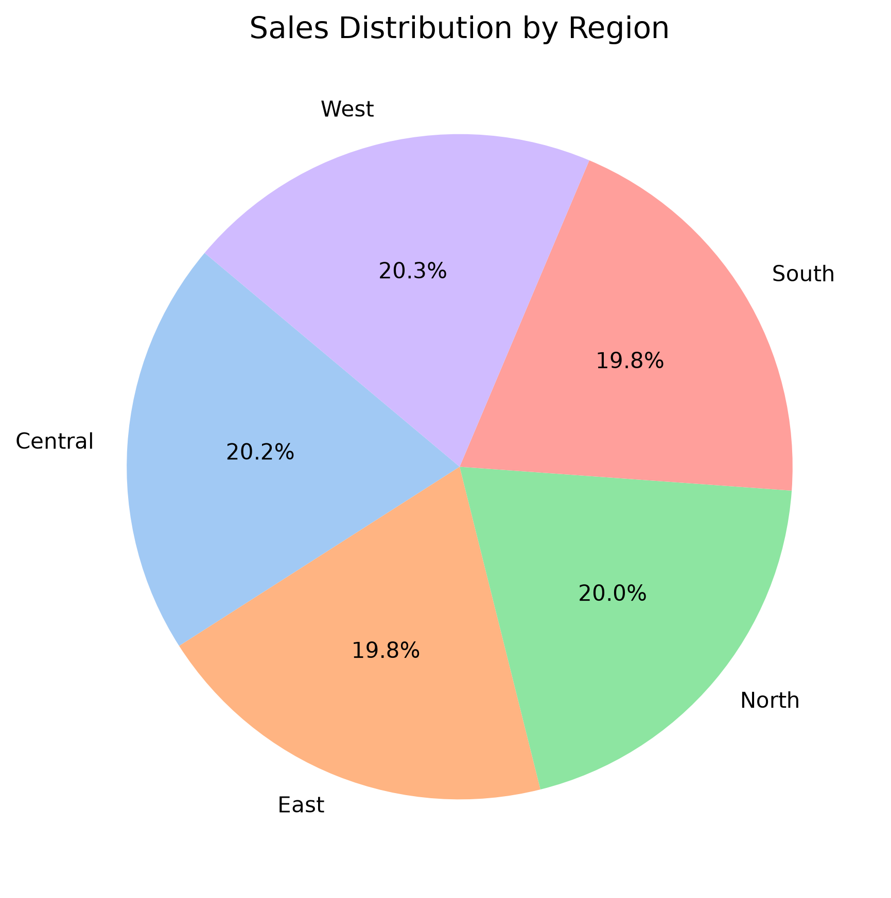
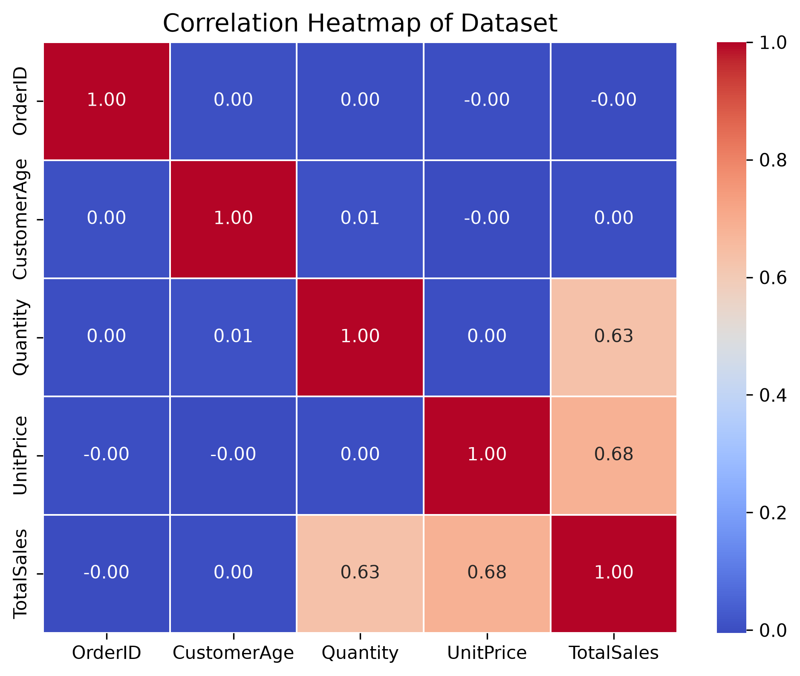

# 🛒 E-Commerce Sales Performance & Big Data Analysis (100k Rows)

A high-performance exploratory data analysis (EDA) project built with Python and Pandas, processing and analyzing a synthetic e-commerce dataset of **100,000 rows**. This project demonstrates advanced data handling, fast aggregations, and professional-grade data visualizations to showcase data science and portfolio proficiency.

---

## 🚀 Project Overview

When working with large-scale datasets, traditional tools like Excel can bottleneck or crash. This project highlights Python's efficiency in managing, cleaning, aggregating, and visualizing 100,000+ transactional records in mere seconds.

---

## 🛠️ Tech Stack & Libraries

- **Language:** Python
- **Data Manipulation & Processing:** Pandas, NumPy
- **Data Visualization:** Matplotlib, Seaborn
- **Environment:** Jupyter Notebook

---

## 📊 Key Analysis & Features

1. **Large-Scale Data Generation:** Programmatically generated 100k structured e-commerce rows including Order IDs, Customer Age, Gender, Product Category, Quantity, Unit Price, Order Dates, and Regions.
2. **High-Speed Aggregations:** Utilized optimized Pandas `groupby` and `agg` functions to summarize multi-million revenue metrics across categories and regions in fractions of a second.
3. **Statistical Insights:** Cleaned missing values, handled data transformations (e.g., scaling currencies into Millions for UI clarity), and conducted correlation analyses.

---

## 📈 Visualizations & Insights

### 1. Total Sales by Product Category



### 2. Daily Sales Trend Over Time



### 3. Customer Age Distribution



### 4. Sales Distribution by Region



### 5. Dataset Correlation Heatmap



---

## ⚙️ How to Run the Project

1. Clone the repository:
   ```bash
   git clone [https://github.com/chathuranga-senanayaka/ecommerce-data-analysis-python.git]
   ```
